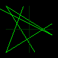

# tiny-renderer 简单的软光栅化渲染器
- [x] 基础数学库
- [x] Bresenham画线算法
- [x] Cohen-Sutherland线段裁剪算法
- [x] glTF模型加载
- [x] 模型/视图/投影变换
- [ ] 背面剔除
- [ ] 深度缓冲
- [ ] Blinn–Phong着色模型
- [x] 重心坐标插值

## 运行
1. bresenham画线算法
```
cargo run --example bresenham_line
```

## 截图


## 参考
- [ssloy/tinyrenderer](https://github.com/ssloy/tinyrenderer) and [wiki](https://github.com/ssloy/tinyrenderer/wiki)
- [skywind3000/mini3d](https://github.com/skywind3000/mini3d)
- [cadenji/foolrenderer](https://github.com/cadenji/foolrenderer#-how-to-learn-computer-graphics)
- [线性代数的本质 - B站](https://www.bilibili.com/video/BV1ys411472E)
- [GAMES101 - B站](https://www.bilibili.com/video/BV1X7411F744/)
- [bresenham算法绘制直线 - B站](https://www.bilibili.com/video/BV1364y1d7Lo)
- [如何开始用 C++ 写一个光栅化渲染器？ - 知乎](https://www.zhihu.com/question/24786878)
- [四元数的可视化 - B站](https://www.bilibili.com/video/BV1SW411y7W1)
- [如何形象地理解四元数？ - 知乎](https://www.zhihu.com/question/23005815)
- [Cohen–Sutherland线段裁剪算法 - Wikipedia](https://en.wikipedia.org/wiki/Cohen%E2%80%93Sutherland_algorithm)
