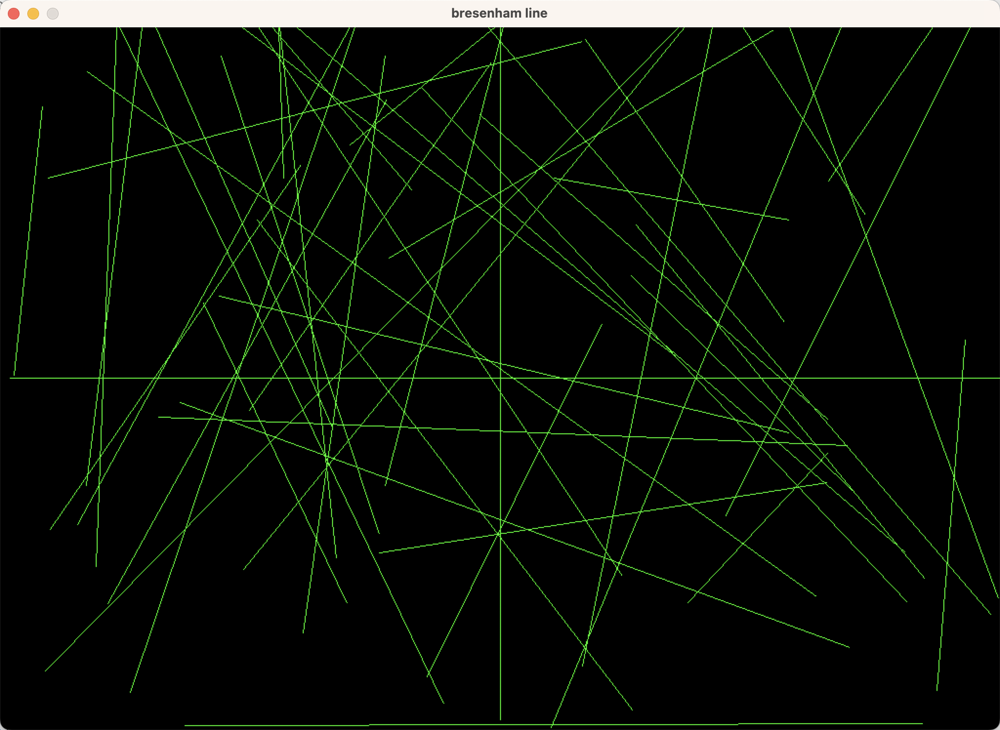

# tiny-renderer 简单的光栅化软渲染器
- [x] 基础数学库
- [x] Bresenham画线算法
- [x] Cohen-Sutherland线段裁剪算法
- [x] glTF模型加载
- [x] 模型/视图/投影变换
- [x] 背面剔除
- [ ] 视椎剔除
- [ ] 齐次空间裁剪
- [x] 深度测试
- [x] 顶点和片段着色器
- [x] 重心坐标插值
- [x] 透视矫正
- [x] Blinn–Phong反射模型
- [x] 纹理映射
- [x] 相机控制

## 运行
1. bresenham画线算法
```
cargo run --example bresenham_line
```
2. 渲染
```
cargo run --example rendering
```

控制
- F1 切换线框渲染
- F2 切换顶点颜色插值
- F3 切换片段着色
- F4 切换投影方式
- W/A/S/D/Q/E 控制相机移动

## 截图



## 参考
- [ssloy/tinyrenderer](https://github.com/ssloy/tinyrenderer) and [wiki](https://github.com/ssloy/tinyrenderer/wiki)
- [skywind3000/mini3d](https://github.com/skywind3000/mini3d)
- [VisualGMQ/rs-cpurenderer](https://github.com/VisualGMQ/rs-cpurenderer)
- [arrayJY/tiny-renderer](https://github.com/arrayJY/tiny-renderer)
- [线性代数的本质 - B站](https://www.bilibili.com/video/BV1ys411472E)
- [GAMES101 - B站](https://www.bilibili.com/video/BV1X7411F744/)
- [bresenham算法绘制直线 - B站](https://www.bilibili.com/video/BV1364y1d7Lo)
- [如何开始用 C++ 写一个光栅化渲染器？ - 知乎](https://www.zhihu.com/question/24786878)
- [四元数的可视化 - B站](https://www.bilibili.com/video/BV1SW411y7W1)
- [如何形象地理解四元数？ - 知乎](https://www.zhihu.com/question/23005815)
- [Cohen–Sutherland线段裁剪算法 - Wikipedia](https://en.wikipedia.org/wiki/Cohen%E2%80%93Sutherland_algorithm)
- [图形学 - 关于透视矫正插值那些事 - 知乎](https://zhuanlan.zhihu.com/p/403259571)
