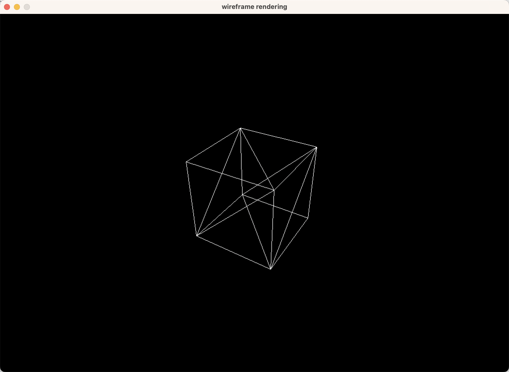
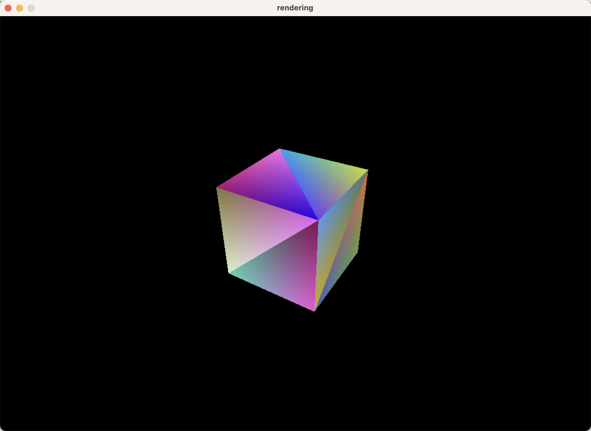
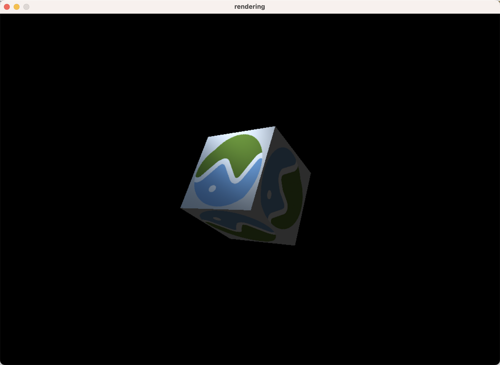

# tiny-renderer
- [x] Basic math library
- [x] Bresenham line drawing algorithm
- [x] Cohen-Sutherland line clipping algorithm
- [x] glTF model loading
- [x] Model/view/projection transformation
- [x] Back-face culling
- [ ] View frustum culling
- [ ] Homogeneous space clipping
- [x] Depth testing
- [x] Vertex and fragment shaders
- [x] Barycentric coordinate interpolation
- [x] Perspective correction
- [x] Blinn–Phong reflection model
- [x] Texture mapping
- [x] Camera control

## Get started
1. Bresenham line drawing algorithm
```
cargo run --example bresenham_line
```
2. Rendering
```
cargo run --example rendering
```

Control
- F1 Toggle wireframe rendering
- F2 Toggle vertex color interpolation
- F3 Toggle fragment shading
- F4 Toggle projection mode
- W/A/S/D/Q/E Control camera movement

## Screenshots







## References
- [ssloy/tinyrenderer](https://github.com/ssloy/tinyrenderer) and [wiki](https://github.com/ssloy/tinyrenderer/wiki)
- [skywind3000/mini3d](https://github.com/skywind3000/mini3d)
- [VisualGMQ/rs-cpurenderer](https://github.com/VisualGMQ/rs-cpurenderer)
- [arrayJY/tiny-renderer](https://github.com/arrayJY/tiny-renderer)
- [Cohen–Sutherland algorithm - Wikipedia](https://en.wikipedia.org/wiki/Cohen%E2%80%93Sutherland_algorithm)